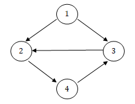

Program that implements a weighted, directed graph data structure
* Also implements BFS and DFS traversal
* Implements a function that returns a list of unconnected nodes, given a
source node and a list of all nodes in the graph 
* Based on the CLRS algorithms

Graph used in runner is:
